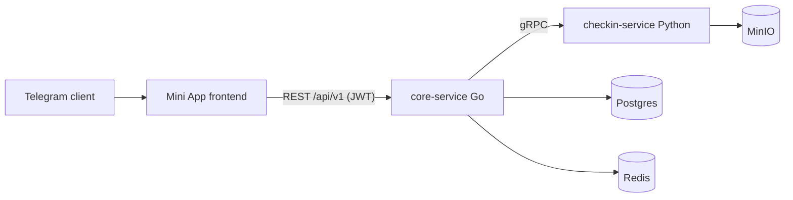

# BuddyGym Frontend

Telegram Mini App for BuddyGym: people gather in small rooms and keep each other accountable for gym visits. A workout is proven either by a photo that room members vote on, or by a geo tag (instant approval). Regular training earns achievements and statuses.

## Stack

- React 19, TypeScript 7 (native Go compiler), Vite 8
- TanStack Router (file-based, type-safe) + TanStack Query 5
- CSS Modules + design tokens (light/dark themes)
- Motion 12 for animations
- `@telegram-apps/sdk-react` for Telegram Mini Apps integration
- MSW 2 for the API mock mode and tests, Vitest + Testing Library
- Biome 2 for lint and format

## Architecture



The frontend talks only to core-service. Auth is invisible: on launch the app exchanges Telegram `initData` for a JWT via `POST /api/v1/auth/telegram` and silently re-authenticates on 401.

## Development

```bash
npm ci
npm run msw:init   # one-time: generate the MSW service worker
npm run dev:mock   # full UI without a backend (MSW mocks)
npm run dev        # real backend: proxies /api -> http://localhost:8080
```

Quality gates (run before every commit, all enforced in CI):

```bash
npm run lint && npm run typecheck && npm run test && npm run build
```

### Against the real backend

Start the backend stack from the BuddyGym repo (`docker compose up`), then `npm run dev`. Vite proxies `/api` to `localhost:8080`, so there is no CORS in development.

Full auth requires valid Telegram `initData` signed by the bot token, which only exists when the app is launched from Telegram. Expose the dev server through a tunnel (e.g. `cloudflared tunnel --url http://localhost:5173`) and set the tunnel URL as the Mini App URL in BotFather. For day-to-day UI work use the mock mode instead.

## Deployment notes

- core-service currently sets no CORS headers, so in production the static frontend must be served same-origin with the API (e.g. nginx/caddy in the backend docker-compose serving `dist/` and proxying `/api` to core).
- checkin-service is not built yet: checkin and vote endpoints return 502. The UI handles this with a dedicated "checkins temporarily unavailable" state.

## Known issues

- `npm audit` reports a transitive ReDoS advisory in `valibot` pulled in by `@telegram-apps/sdk`. Upstream issue; the only "fix" npm offers is a downgrade to SDK v2. Low practical risk (the affected regex parses theme params), tracked until the SDK updates its dependency.
